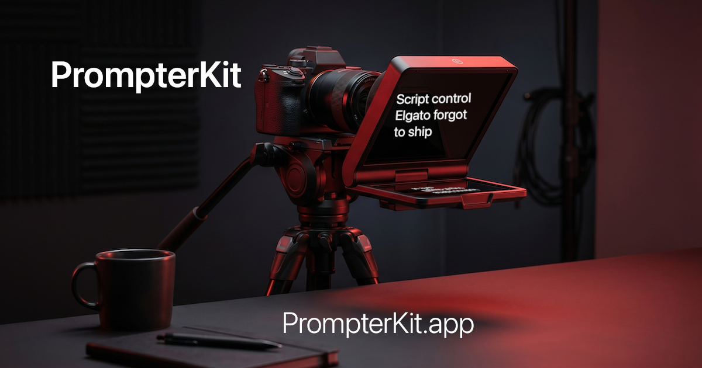

# PrompterKit



Manage your Elgato Prompter scripts from the command line or a local web GUI.
Camera Hub stores scripts in opaque JSON with no import, export, rename,
reorder, or backup path. PrompterKit fills every gap.

Site: https://prompterkit.app/
Repo: https://github.com/snapsynapse/prompter-kit

Based on [spieldbergo/elgato_prompter_text_importer](https://github.com/spieldbergo/elgato_prompter_text_importer) (MIT).

## Requirements

- Python 3.10+
- Elgato Camera Hub installed
- Flask for the GUI: `python3 -m pip install -r requirements-gui.txt`

Close Camera Hub before any write operation, or use `--restart` / the
`camerahub` subcommand to have PrompterKit do it for you.

## Quick start

PrompterKit installs two ways. AI Assisted Install is the simplest; Terminal
Install is the manual path.

<details open>
<summary>AI Assisted Install</summary>

The simplest way to install PrompterKit: ask ChatGPT, Claude, Codex, or another
local coding assistant to walk you through setup. Point it at the structured
guide and approval checklist at
https://prompterkit.app/.well-known/assistant-guide.txt and approve commands one
at a time.

That guide follows the [GuideCheck](https://guidecheck.org/) standard, a
plain-text, strict-ASCII format that keeps what a human reviews identical to
what an assistant executes. It is built to GuideCheck conformance Level 4,
the highest guide-file level: strict byte profile, safety contract, action
approval gates, sidecar manifest, public transparency-log anchor, and public
repository hash anchor. It can be checked with the verifier at
https://guidecheck.org/verify.
Level 4 evidence is published alongside the guide:
https://prompterkit.app/.well-known/assistant-guide-manifest.txt and
https://prompterkit.app/.well-known/assistant-guide-transparency-log.txt.

The short version: only use the official repository, ask the assistant to
explain every command before running it, do not approve `sudo` or shell scripts
downloaded from the web, and make a PrompterKit backup before any write
operation touches Camera Hub data.

</details>

<details>
<summary>Terminal Install</summary>

Requires Python 3.10 or later. Clone the repo, create a local virtual
environment, install the GUI dependency, and launch:

```text
git clone https://github.com/snapsynapse/prompter-kit.git
cd prompter-kit
python3 -m venv .venv
source .venv/bin/activate
python3 -m pip install -r requirements-gui.txt
python3 prompter_kit_gui.py
```

On Windows, activate the virtual environment with `.venv\Scripts\activate`.

The GUI opens a local web app at `http://127.0.0.1:5000` for import, export,
rename, delete, and index normalization, with drag-and-drop file input.

To test against a copied Camera Hub folder instead of live device data, or to
skip the automatic browser launch:

```text
PROMPTERKIT_BASE_DIR=/tmp/prompterkit-eval python3 prompter_kit_gui.py
PROMPTERKIT_OPEN_BROWSER=0 python3 prompter_kit_gui.py
```

</details>

## CLI commands (optional)

Prefer the terminal? After setting up the virtual environment (see Terminal
Install above), every action is also a one-liner:

```
# Import a .txt or .md file (one line per chapter)
python3 prompter_kit.py import script.md --name "My Script"

# Import and auto-restart Camera Hub around the write
python3 prompter_kit.py import script.txt --name "My Script" --restart

# Same operation using push/pull language
python3 prompter_kit.py push script.txt --name "My Script" --restart
python3 prompter_kit.py pull --name "My Script" --output my_script.txt

# List registered scripts
python3 prompter_kit.py export --list

# Export one script by name or GUID
python3 prompter_kit.py export --name "My Script" --output my_script.txt

# Export every script to a directory
python3 prompter_kit.py export --all --output ./exported/

# Rename, delete, reorder
python3 prompter_kit.py rename "Old Name" "New Name"
python3 prompter_kit.py delete "My Script"
python3 prompter_kit.py reindex "Intro" "Act One" "Outro"

# Edit chapters in $EDITOR
python3 prompter_kit.py edit "My Script"

# Back up and restore the whole library
python3 prompter_kit.py backup --output backup.zip
python3 prompter_kit.py restore backup.zip           # replaces library
python3 prompter_kit.py restore backup.zip --merge   # adds new only

# Quit or relaunch Camera Hub
python3 prompter_kit.py camerahub stop
python3 prompter_kit.py camerahub start

# Diagnose the Camera Hub data directory
python3 prompter_kit.py doctor

# Test against a copied Camera Hub folder instead of the live one
python3 prompter_kit.py doctor --base-dir /tmp/prompterkit-eval
python3 prompter_kit.py push script.txt --name "Eval Script" --base-dir /tmp/prompterkit-eval

# Opt-in live smoke test against the real Camera Hub directory
scripts/manual_live_eval.sh
```

The CLI remains the complete surface for explicit reorder, backup, and restore
workflows.

## Commands

| Command | What it does |
|---|---|
| `import` | Register a `.txt` or `.md` file as a Prompter script. Markdown formatting is stripped. |
| `push` | Alias for `import`, for pushing a local script into Camera Hub. |
| `export` | Write a script, or all scripts, back to `.txt`. Supports `--list`, `--name`, `--guid`, `--all`. |
| `pull` | Alias for `export`, for pulling scripts out of Camera Hub. |
| `delete` | Remove a script from `Texts/` and `AppSettings.json`. |
| `rename` | Change a script's friendly name. |
| `reindex` | Reorder the library. Pass names/GUIDs in desired order, or no args to normalize. |
| `edit` | Open a script's chapters in `$EDITOR` and re-save on close. |
| `backup` | Zip all scripts plus `AppSettings.json` into a timestamped archive. |
| `restore` | Restore from a backup zip. `--merge` keeps existing scripts. |
| `doctor` | Report Camera Hub path, AppSettings/Text status, missing scripts, duplicate names, orphan files, and whether Camera Hub appears to be running. |
| `camerahub stop` / `start` | Quit or relaunch Camera Hub (macOS `osascript`, Windows `taskkill`). |

Most commands accept `--base-dir` after the command name. Use it to run against
a copied Camera Hub directory before touching the live device data.

## Script format

Plain `.txt` or `.md`. Each non-empty line becomes one chapter.

```markdown
# Act One

- Welcome to the show.
- **Tonight** we cover three topics.
```

imports as three plain chapters. Markdown headings, bold, italic, links,
images, inline code, blockquotes, list bullets, and strikethrough are stripped.

## Safety

- Atomic writes: JSON is written to a temp file then renamed, so an
  interrupted write cannot corrupt `AppSettings.json`.
- Post-write verification: write operations reload `AppSettings.json` and the
  script JSON immediately, then fail if the expected change is not visible.
- Rollback: if updating `AppSettings.json` fails after writing a new script
  JSON, the script JSON is removed.
- Restore validation: before writing anything, `restore` checks that the zip
  contains a valid `AppSettings.json`, that every GUID matches `[A-Za-z0-9._-]+`,
  that no unexpected paths are present, and that each script's embedded GUID
  matches the filename. Replace mode stages replacement files before swapping
  them into place and rolls back the live files if the swap fails.

## Data locations

| Platform | Path |
|---|---|
| macOS | `~/Library/Application Support/Elgato/Camera Hub/` |
| Windows | `%APPDATA%\Elgato\Camera Hub\` |

PrompterKit falls back to the legacy `CameraHub` directory when only that older
path exists.

## Running tests

```
python3 -m pytest tests/ -v
```

107 tests cover import, export, push/pull aliases, CRUD, GUI routes, CSRF
protection, upload validation, backup/restore, Markdown stripping, atomic-write
rollback, post-write verification, diagnostics, fixture compatibility,
base-directory overrides, simulated overwrite failures, Camera Hub path
discovery, and restore validation.

Run the GUI smoke eval against a disposable fixture copy:

```
scripts/gui_smoke_eval.sh
```

Run the opt-in live eval against the real Camera Hub directory:

```
scripts/manual_live_eval.sh
```

## Contributing

See [CONTRIBUTING.md](CONTRIBUTING.md) and [ARCHITECTURE.md](ARCHITECTURE.md).

## License

MIT. See [LICENSE](LICENSE).
